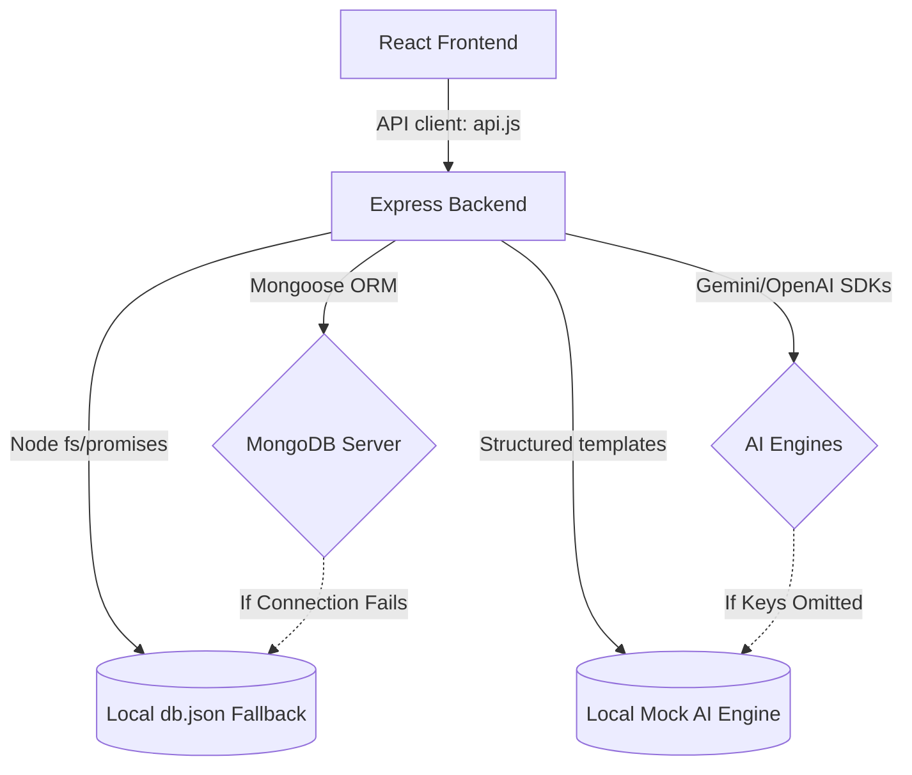

# Book-to-Blog AI Converter & Reading Journey 📖✍️

A premium full-stack application designed to transform raw book notes, highlights, and lessons into well-structured, Medium-ready blog posts, LinkedIn cards, and Twitter/X threads using AI, while tracking reading growth along an interactive visual timeline.

## 📐 System Architecture



---

## ⚡ Highlights & Features
- **AI Blog Generator:** Weave notes into structured blog posts with options for **Casual**, **Professional**, or **Storytelling** tones.
- **Social Media Expander:** Extract copy-ready LinkedIn posts and custom-compiled Twitter threads (with individual character trackers).
- **Split-Screen Markdown Editor:** Side-by-side WYSIWYG editor and previewer replicating Medium's typography.
- **Reading Journey Timeline:** Dynamic, vertical SVG journey tracker mapping out book-start dates, completions, and written articles.
- **Personal Knowledge Archive:** Searchable vault with semantic-like filtering across book notes, metadata, and blog content.
- **Zero-Config Resilient Mode:** Automatic fallbacks to a local file-based database store (`backend/data/db.json`) and high-fidelity Mock AI templates if MongoDB is offline or API keys are missing.

---

## 🚀 How to Run the App Locally

### Prerequisites
Ensure you have [Node.js](https://nodejs.org/) installed (v18+ recommended).

### Step 1: Start the Backend Express Server
1. Open a terminal in the root directory and navigate to `backend`:
   ```bash
   cd backend
   ```
2. Install the backend dependencies:
   ```bash
   npm install
   ```
3. Boot the backend server in development mode (watches for file changes):
   ```bash
   npm run dev
   ```
   *The backend will start on **`http://localhost:5000`** and log either `[LOCAL JSON]` or `[MONGODB]` mode.*

### Step 2: Start the Frontend React App
1. Open a **new, separate terminal** in the root directory and navigate to `frontend`:
   ```bash
   cd frontend
   ```
2. Install the frontend dependencies:
   ```bash
   npm install
   ```
3. Launch the Vite development server:
   ```bash
   npm run dev
   ```
4. Open the displayed URL (usually **`http://localhost:3000`**) in your web browser.

---

## 🛠️ Configuration (Real AI & MongoDB Setup)

To unlock live AI generation (Gemini or OpenAI) and store your bookshelf on MongoDB:

1. Locate the file `backend/.env`.
2. Add your credentials:
   ```env
   # Add your preferred AI key (Gemini is recommended for free tiers)
   GEMINI_API_KEY=AIzaSy...
   
   # Optional: OpenAI API Key
   OPENAI_API_KEY=sk-proj-...

   # Optional: MongoDB Connection URI (Leave blank to keep using the local db.json file)
   MONGODB_URI=mongodb+srv://<user>:<password>@cluster.mongodb.net/booktoblog
   ```
3. Save the file and **restart the backend server** (`npm run dev`). The status badge in the sidebar will update in real-time to reflect your active keys and database!

---

## 📂 Project Structure
```
d:\book to blog\
├── backend/                  # Node.js + Express Backend
│   ├── data/                 # Local JSON database storage
│   ├── src/
│   │   ├── config/           # Database setup (Mongoose + JSON fallback)
│   │   ├── routes/           # REST endpoints (books, blogs, stats)
│   │   ├── services/         # Gemini & OpenAI adapters
│   │   └── index.js          # Express entry point
│   ├── .env                  # Port, DB, and API Key configuration
│   └── package.json
└── frontend/                 # React + Vite + Tailwind CSS v4 Frontend
    ├── src/
    │   ├── components/       # Layout widgets
    │   ├── pages/            # Dashboard, Editor, Generator, Archive
    │   ├── utils/            # API fetch client
    │   ├── App.jsx           # Sidebar and Router
    │   ├── index.css         # Styling system & custom animations
    │   └── main.jsx
    ├── index.html            # Web template with custom fonts
    ├── package.json
    └── vite.config.js        # Vite build & proxy configurations
```
